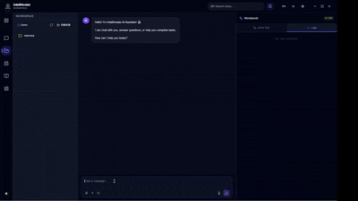

# IntelliAvatar  
### The AI Worker OS — from chat to true desktop autonomy.

IntelliAvatar is **not a chatbot**.  
It is an **AI Worker Operating System** that performs real work on a real computer —  
clicking, typing, navigating apps, reading screens, organizing files, running workflows,  
and executing multi-step tasks end-to-end like a digital employee.

> **Our mission: Give AI the ability to *do things*, not just talk.**

This project is under active development and being built fully in public.

---

## 🚀 Vision

Modern AI can answer questions—  
but it still cannot reliably operate a computer.

**IntelliAvatar aims to change that.**

We are building a full-stack desktop agent capable of:

- Planning multi-step tasks  
- Visually operating Windows apps (GUI actions)  
- Running autonomous workflows  
- Observing → deciding → acting → re-planning  
- Managing files, browsers, documents, apps  
- Executing scheduled & recurring automation  
- Maintaining memory to improve over time  
- Behaving like a true digital worker, not a chat interface

This is early, but the foundation is improving rapidly.

---
## 🎬 Demo (Early Prototype)

IntelliAvatar can already perform fully autonomous desktop tasks.
Below is a real example — no macros, no scripts, no shortcuts.

### File Workflow Demo 

-Generate a short poem

-Save it into a Word document (poem_demo.docx)

-Automatically open the document after creation

## 🎨 UI Concepts (Early Explorations)

> These UI sketches illustrate the future direction of IntelliAvatar.

### 🖥️ Control Panel  
*(insert screenshot here)*

### 🗂️ Workspace / Task Flow  
*(insert screenshot here)*

More UI visuals will be added as the system evolves.

---

## 🧠 Core System Pillars (Architecture Overview)

> Source code is currently private while the architecture stabilizes.

- **Skills Engine**  
  File ops, GUI ops, browser ops, custom skills

- **Planner (Intent → Task Graph)**  
  Linear + DAG structures, multi-stage reasoning

- **Runtime / Agent Loop**  
  Execution, retries, re-planning, self-correction

- **Perception Layer** *(upcoming)*  
  Screen reading, UI element detection, OCR

- **Memory System**  
  Short-term → long-term → knowledge base

- **Scheduler**  
  Recurring tasks and automation routines

- **Shadow Mode** *(planned)*  
  Real-time autonomous desktop control

A modular system designed to scale into a full AI Worker OS.

---

## 📌 Current Status (Prototype Stage)

- End-to-end skill invocation pipeline working  
- File operations & basic desktop automation  
- Planner v1 implemented  
- Task graph + runtime agent loop functioning  
- Logging & execution monitoring  
- UI prototypes (Control Panel, Workspace)  
- Python execution + document manipulation  
- OS interaction expanding  
- Rapid iteration ongoing  

---

## 🗓️ Recent Progress Logs (Build-in-Public)

### **Dec 3, 2025**
- Added new workspace automation demo  
  → Create folder → move files → rename → open folder  
- Improved skill selection reliability  
- Reduced LLM failures caused by long prompts  
- Updated Workspace layout  
- Work-in-progress: Python chart generation pipeline

### **Dec 2, 2025**
- Fixed multiple timeout issues  
- Improved file system watcher stability  
- Successful Word automation demo (poem → docx → open)

### **Dec 1, 2025**
- Stabilized file creation + document automation pipeline  
- Enabled basic GUI operations (open apps, typing, clicking)

More logs will be added daily.

---

## 🗺️ Roadmap

See full roadmap here:  
👉 **[`ROADMAP.md`](./docs/ROADMAP.md)**

**High-Level Milestones:**

1. Foundations & Skill System  
2. Planner v2 + Reliable Task Engine (DAG)  
3. Desktop Autonomy Layer  
4. Memory, Persona, Knowledge System  
5. Multi-App Intelligence  
6. Fully Autonomous Digital Employee

---

## 📂 Repository Structure (Documentation Only)

